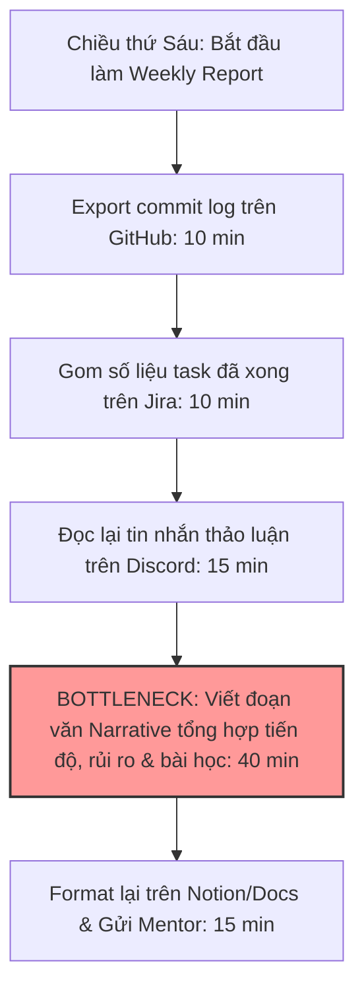
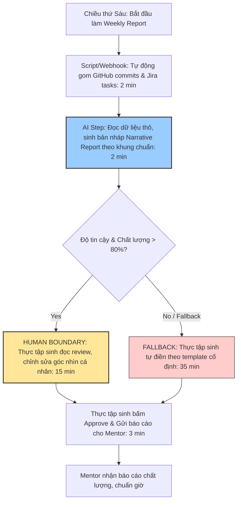
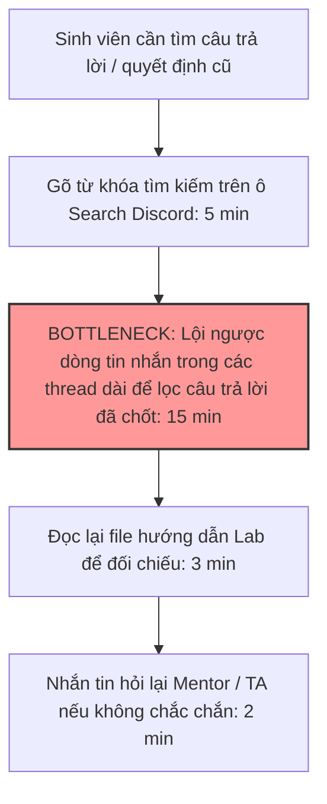
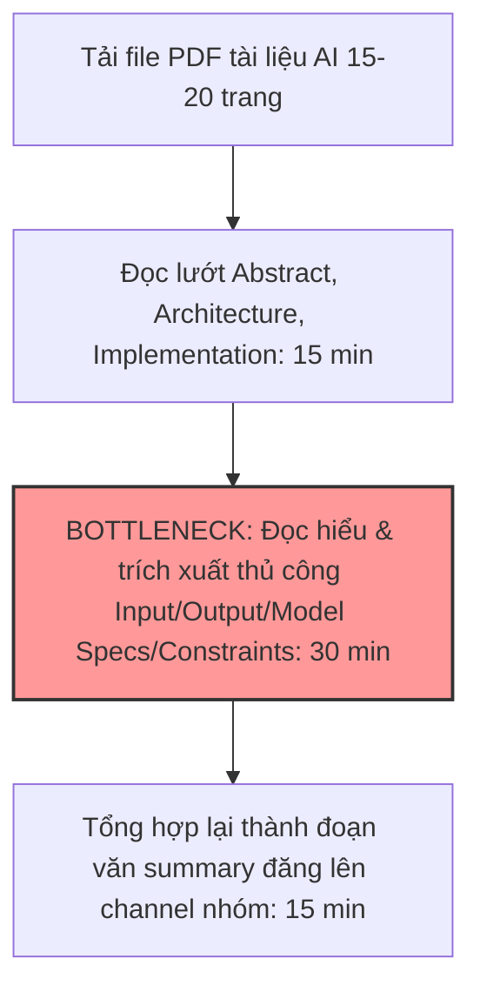
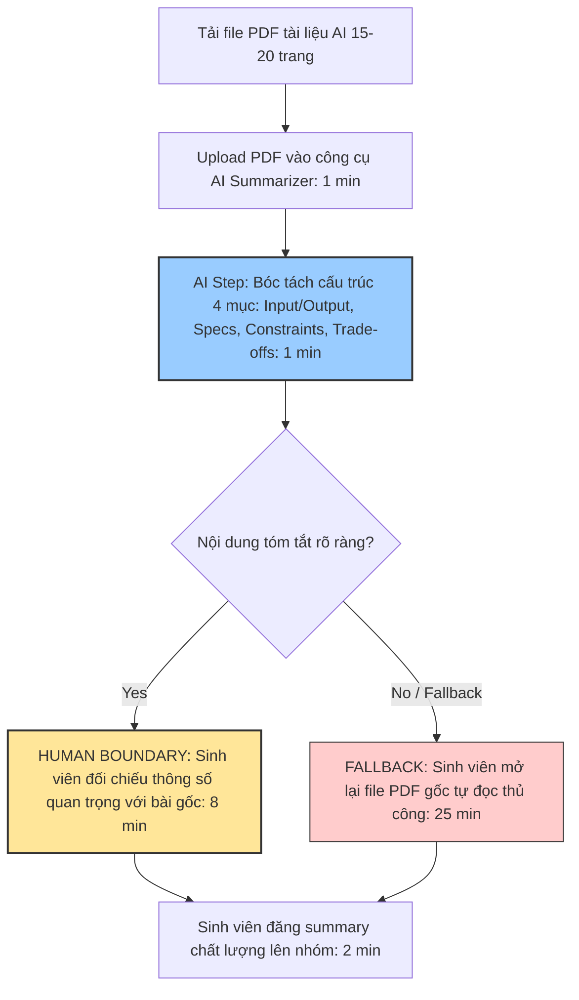

# 01 — Individual Problem Scan

> **Báo cáo phân kỳ cá nhân** — Day 02 Lab: Tìm Đúng Bài Toán Cho AI  
> **Học viên / Persona:** Sinh viên AI Product Lab / Thực tập sinh AI Product (AI Product Intern).

---

## 1. Broad Problem Scan (10 Candidate Problems)

Dưới đây là danh sách 10 vấn đề quan sát từ trải nghiệm thực tế của một sinh viên / thực tập sinh AI Product trong quá trình học tập tại AI Lab, làm dự án nhóm và thực tập tại doanh nghiệp, quét qua 4 lăng kính chính (*Lặp lại, Tốn thời gian, AI có thể làm tốt hơn, Pain từ người khác*).

| # | Lăng kính | Problem quan sát được | Actor (Ai chịu ảnh hưởng?) | Workflow quan sát được | Dấu hiệu / bằng chứng thật | Thời gian & tần suất |
|---|---|---|---|---|---|---|
| 1 | **Lặp lại** | Viết báo cáo thực tập hàng tuần (Weekly Progress Report) từ GitHub commit log, Jira & Discord | Thực tập sinh AI, Mentor, Team Lead | Export commit log → đọc ticket Jira đã xong → tổng hợp chat Discord → viết narrative update → self-review | Mất cả chiều thứ Sáu; văn bản khô khan hoặc thiếu góc nhìn tổng thể | ~90 phút/tuần |
| 2 | **Tốn thời gian** | Tra cứu quyết định kỹ thuật cũ & câu hỏi lặp lại rải rác trên Discord lớp học AI Lab | Sinh viên AI Lab, Bạn cùng nhóm, Mentor | Search từ khóa Discord → lội qua hàng trăm tin nhắn thảo luận → đọc doc cũ → hỏi lại Mentor | Mentor và các bạn hay trả lời cùng 1 câu hỏi 3-4 lần/tuần | 20-30 phút/lần tra cứu |
| 3 | **Tốn thời gian** | Đọc & tóm tắt tài liệu AI (AI Paper / Tech Spec / Framework Docs 15-20 trang) trước khi chọn model | Sinh viên dự án AI, AI Engineer | Đọc file PDF dài → nhặt input/output format → ghi chú constraint → so sánh các model | Mất 2-3 lượt đọc lại mới nắm đủ thông tin để họp nhóm | 45-60 phút/bản doc |
| 4 | **Lặp lại** | Soạn slide recap & Meeting notes sau mỗi buổi họp sync nhóm dự án / gặp Mentor | Leader nhóm sinh viên, Thành viên nhóm | Nghe lại recording họp → đọc chat log → tổng hợp Action Items → gõ lên Notion → tag thành viên | Mất 30-40 phút sau mỗi buổi họp sync 45 phút | 30-40 phút/buổi họp |
| 5 | **AI có thể tốt hơn** | Tìm kiếm hình ảnh / asset thiết kế trong dự án AI bằng mô tả ngôn ngữ tự nhiên (CLIP/BLIP Search) | Sinh viên làm dự án AI Multimodal, UI Designer | Mở folder chứa 500+ ảnh → dùng mắt lướt tìm → mở từng ảnh kiểm tra → copy link | Search tên file không hiệu quả vì tên ảnh dạng `IMG_1024.jpg` | 10-15 phút/lần tìm |
| 6 | **AI có thể tốt hơn** | Review code chéo (Peer Review) và tổng hợp feedback bài nộp trên GitHub Classroom | Sinh viên, Peer Reviewer, TA (Trợ giảng) | Đọc PR trên GitHub → kiểm tra syntax/style → viết comment feedback → đối chiếu rubric | Nhận xét hay bị cảm quan, thiếu độ nhất quán giữa các bài | 30-40 phút/PR |
| 7 | **Pain từ người khác** | Thành viên nhóm hỏi đi hỏi lại về Spec API / Schema dữ liệu của dự án khi chưa có doc chuẩn | FE Developer, BE Developer, Product Intern | Dev nhận task → thấy thiếu field response → ping Discord PM → PM hỏi lại BE → trả lời | Message gián đoạn công việc của thành viên 4-5 lần/ngày | 10-15 phút/lần trao đổi |
| 8 | **Pain từ người khác** | Cuống cuồng kiểm tra đủ checklist file nộp bài Lab sát giờ deadline do cấu trúc folder phức tạp | Nhóm trưởng sinh viên, Thành viên nhóm | Gom file từ các bạn → check từng folder `01-`, `02-`, `03-` → đối chiếu rubric → nộp repo | Hay bị thiếu file screenshot hoặc sai đường link markdown | 20-30 phút sát deadline |
| 9 | **Lặp lại** | Viết hướng dẫn setup môi trường (Environment Setup Guide: Python, CUDA, venv) cho dự án AI | AI Intern, Thành viên mới gia nhập repo | Đọc file requirements → tự cài → dính lỗi dependency → gõ doc hướng dẫn sửa lỗi | Thành viên mới mất cả buổi đầu tiên chỉ để run được dự án | 2-3 giờ/lần onboarding |
| 10 | **Tốn thời gian** | Phân loại & tổng hợp phản hồi người dùng thử nghiệm Demo App (User Testing Notes) sau Demo Day | Product Intern, UX Tester | Download CSV kết quả thử nghiệm → đọc từng câu trả lời → nhóm theo tính năng → viết summary | Phân loại thủ công bằng tay kéo dài đến tận khuya | 2-3 giờ/đợt demo |

---

## 2. Top 3 Selection & Rationale

Từ 10 vấn đề trên, tôi tiến hành chấm điểm và chọn ra Top 3 bài toán tiềm năng nhất để đưa vào đánh giá sâu.

### Bảng chấm điểm chọn Top 3

| Candidate Problem | Workflow rõ (1-5) | Bottleneck rõ (1-5) | Dấu hiệu thật (1-5) | Impact đo được (1-5) | Khả thi trong Lab (1-5) | Tiềm năng Validate (1-5) | Tổng điểm | Xếp hạng |
|---|---:|---:|---:|---:|---:|---:|---:|---:|
| **#1: Viết báo cáo thực tập hàng tuần (Weekly Report)** | 5 | 5 | 5 | 5 | 5 | 4 | **29** | **Rank 1** |
| **#2: Tra cứu quyết định & Q&A cũ trên Discord AI Lab** | 4 | 5 | 5 | 4 | 5 | 5 | **28** | **Rank 2** |
| **#3: Đọc & tóm tắt tài liệu AI (AI Paper / Tech Spec)** | 5 | 4 | 4 | 4 | 4 | 4 | **25** | **Rank 3** |
| #4: Meeting notes & Action Items sau họp sync | 4 | 4 | 4 | 3 | 4 | 4 | 23 | Rank 4 |
| #5: CLIP/BLIP Search cho asset dự án AI | 4 | 3 | 4 | 4 | 3 | 3 | 21 | Rank 5 |
| #8: Kiểm tra checklist file nộp bài sát deadline | 5 | 3 | 3 | 3 | 5 | 2 | 21 | Rank 6 |

### Lý do lựa chọn Top 3:
1. **Rank 1 — Viết báo cáo thực tập hàng tuần (#1):** Workflow cố định hằng tuần, tần suất 100% sinh viên thực tập đều gặp, bottleneck nằm ở đoạn tổng hợp các dữ liệu rời rạc (GitHub, Jira, Discord) thành bài báo cáo narrative có chất lượng cho Mentor. Đo lường chính xác bằng thời gian (90 phút → <25 phút).
2. **Rank 2 — Tra cứu quyết định & Q&A cũ trên Discord (#2):** Pain point cực kỳ phổ biến trong các lớp học AI Lab và nhóm làm dự án, dữ liệu tin nhắn Discord nằm tản mạn, tốn thời gian lội thread.
3. **Rank 3 — Đọc & tóm tắt tài liệu AI (#3):** Công việc tiêu tốn nhiều thời gian đọc hiểu của sinh viên trước mỗi đợt làm dự án AI mới.

---

## 3. Candidate Elimination (Lý do loại 7 bài toán còn lại)

- **Bài toán #4 (Meeting notes sau họp):** Đã có nhiều công cụ tự động recorder/transcription thương mại (Otter, Fireflies), không mang nhiều bài học mới về thiết kế workflow AI cho sản phẩm.
- **Bài toán #5 (CLIP/BLIP Search asset):** Mang tính kỹ thuật hạ tầng (Computer Vision), scope quá rộng cho một buổi Lab phân tích bài toán sản phẩm.
- **Bài toán #6 (Peer Review code trên GitHub):** Tiêu chuẩn đánh giá code phụ thuộc nhiều vào từng bài tập cụ thể, khó đưa ra rubric cố định.
- **Bài toán #7 (Giải đáp spec cho Dev):** Vấn đề nằm ở khâu giao tiếp nhóm (Process fix), giải quyết bằng việc chuẩn hóa template PRD trên Notion tốt hơn dùng AI.
- **Bài toán #8 (Checklist nộp bài sát deadline):** Chỉ xảy ra sát giờ nộp bài, nguyên nhân do quản lý thời gian cá nhân chứ không phải nút thắt quy trình.
- **Bài toán #9 (Hướng dẫn setup môi trường):** Cách giải quyết tốt nhất là dùng Docker hoặc Conda environment file (Rule/Automation), không cần AI.
- **Bài toán #10 (Tóm tắt User Testing Notes):** Không diễn ra thường xuyên (chỉ làm 1-2 lần ở cuối đợt dự án).

---

## 4. Problem Cards Detail

### Problem Card #1 — Viết báo cáo thực tập hàng tuần (Pitch Candidate chính)

```text
┌────────────────────────────────────────────────────────────────────────┐
│ PROBLEM CARD #1                                                        │
│                                                                        │
│ Problem 1 câu: Thực tập sinh AI tốn 90 phút mỗi chiều thứ Sáu để gom   │
│ dữ liệu từ GitHub, Jira, Discord và gõ báo cáo tiến độ tuần cho Mentor.│
│                                                                        │
│ Ai chịu ảnh hưởng? Thực tập sinh AI Product, Mentor, Team Lead.        │
│                                                                        │
│ Current workflow:                                                      │
│ 1. Export GitHub commit log → 2. Gom ticket Jira → 3. Đọc Slack recap  │
│ → 4. Viết narrative summary → 5. Self-review & Gửi báo cáo            │
│                                                                        │
│ Bước nghẽn nhất: Bước 4 — Tổng hợp thông tin thô thành Narrative       │
│                   Highlight & Risk (35-40 phút)                        │
│                                                                        │
│ Đo thành công bằng gì?: Giảm tổng thời gian làm báo cáo từ 90 phút    │
│                         xuống dưới 25 phút/tuần.                        │
│                                                                        │
│ Quick gut: [ ] No AI / process fix  [ ] Rule  [x] Workflow             │
│            [ ] Agent                [ ] Chưa biết                      │
└────────────────────────────────────────────────────────────────────────┘
```

#### Chi tiết Problem Card #1:
- **Problem 1 câu:** Thực tập sinh AI Product mất 90 phút mỗi chiều thứ Sáu để trích xuất dữ liệu rải rác từ GitHub commit log, Jira tickets và thảo luận Discord để viết bài báo cáo tiến độ tuần (Weekly Progress Narrative) gửi Mentor, trong đó bước viết phần nhận định/rủi ro tốn nhiều thời gian nhất.
- **Actor:** Thực tập sinh AI Product (người viết), Mentor / Team Lead (người đọc).
- **Thời điểm / bối cảnh:** Chiều thứ Sáu hằng tuần trước buổi họp Sync tiến độ thực tập.
- **Current workflow (5 bước):**
  1. Trích xuất danh sách PR/Commit đã merge trên GitHub (10 phút).
  2. Gom số liệu các task đã hoàn thành hoặc kẹt trên Jira/Trello (10 phút).
  3. Đọc lại tin nhắn thảo luận nổi bật trên kênh Discord nhóm (15 phút).
  4. Viết đoạn văn tổng hợp (Narrative): Kết quả đạt được, điểm nghẽn kỹ thuật, bài học rút ra, kế hoạch tuần tới *(Bước nghẽn — 40 phút)*.
  5. Format lại văn bản trên Notion/Google Doc và gửi cho Mentor (15 phút).
- **Bottleneck:** Bước 4 — Chuyển đổi các commit code vô hồn và tin nhắn Discord rời rạc thành bài báo cáo tiến độ có cấu trúc, nêu rõ giá trị tạo ra thay vì chỉ liệt kê task.
- **Impact:** 90 phút/tuần. Báo cáo làm vội hay bị sơ sài, Mentor không nắm rõ thực tế công việc thực tập sinh đang làm.
- **Success metric:**
  - *Thời gian:* Giảm tổng thời gian làm báo cáo từ 90 phút xuống dưới 25 phút/tuần.
  - *Chất lượng:* 100% báo cáo gửi đúng hạn trước 17:00 chiều thứ Sáu; không bị Mentor nhắc nhở vì thiếu thông tin.
- **Non-AI alternative:** Dùng Google Sheets Form hoặc Jira Dashboard tự động. *(Hạn chế: Dashboard chỉ hiện danh sách task, không tự giải thích được nguyên nhân trễ hạn hay bài học kinh nghiệm)*.
- **AI hypothesis:** Script tự động thu thập commit log & Jira data → AI xử lý và tạo bản nháp Báo cáo tiến độ theo khung chuẩn (Highlights, Blockers, Learnings, Next Plan) → Thực tập sinh đọc review, bổ sung góc nhìn cá nhân và gửi Mentor.
- **AI intervention point:** Sau khi dữ liệu thô được gom lại, AI tạo ra bản nháp narrative văn bản.
- **Human boundary:** AI KHÔNG ĐƯỢC tự động gửi báo cáo cho Mentor. Thực tập sinh bắt buộc phải đọc, tự tay chỉnh sửa thông tin cho chính xác và bấm gửi.
- **Potential risks:** AI bịa ra (hallucinate) các khó khăn kỹ thuật không có thật hoặc dùng câu từ quá sáo rỗng.
- **Fallback plan:** Thực tập sinh xóa bản nháp AI và điền thủ công theo khung template cố định nếu bản nháp kém chất lượng.
- **Quick gut:**
  - [ ] No AI / process fix
  - [ ] Rule
  - [x] Workflow
  - [ ] Agent
  - [ ] Chưa biết

---

### Problem Card #2 — Tra cứu quyết định & Q&A cũ trên Discord AI Lab

```text
┌────────────────────────────────────────────────────────────────────────┐
│ PROBLEM CARD #2                                                        │
│                                                                        │
│ Problem 1 câu: Sinh viên AI Lab mất 20-30 phút/lần để lội tin nhắn     │
│ Discord tìm lại câu trả lời hoặc quyết định kỹ thuật cũ đã thảo luận. │
│                                                                        │
│ Ai chịu ảnh hưởng? Sinh viên AI Lab, Bạn cùng nhóm, Mentor / TA.       │
│                                                                        │
│ Current workflow:                                                      │
│ 1. Search keyword Discord → 2. Đọc các thread dài → 3. Kiểm tra Doc   │
│ → 4. Hỏi lại Mentor/TA nếu không tìm thấy                             │
│                                                                        │
│ Bước nghẽn nhất: Bước 2 — Tổng hợp câu trả lời chốt hạ từ hàng chục   │
│                   tin nhắn thảo luận rời rạc (15 phút)                 │
│                                                                        │
│ Đo thành công bằng gì?: Giảm thời gian tra cứu từ 25 phút xuống < 3m. │
│                                                                        │
│ Quick gut: [ ] No AI / process fix  [ ] Rule  [ ] Workflow             │
│            [x] Agent                [ ] Chưa biết                      │
└────────────────────────────────────────────────────────────────────────┘
```

#### Chi tiết Problem Card #2:
- **Problem 1 câu:** Sinh viên AI Lab mất từ 20-30 phút mỗi khi cần tìm lại các câu trả lời về lỗi kỹ thuật, quy định nộp bài hoặc quyết định thiết kế dự án cũ rải rác trên các channel Discord, gây phiền hà cho Mentor/TA khi phải trả lời lại cùng một câu hỏi nhiều lần.
- **Actor:** Sinh viên làm dự án AI, Mentor, TA (Trợ giảng).
- **Current workflow (4 bước):**
  1. Gõ từ khóa tìm kiếm trên ô Search của Discord (5 phút).
  2. Lội ngược dòng tin nhắn trong các thread dài để tìm câu trả lời đã được chốt *(Bước nghẽn — 15 phút)*.
  3. Đọc lại file hướng dẫn Lab để đối chiếu (5 phút).
  4. Nhắn tin hỏi lại TA hoặc Mentor trên kênh chung nếu thông tin mập mờ (5 phút).
- **Bottleneck:** Bước 2 — Tin nhắn thảo luận nằm tản mạn ở nhiều channel, câu trả lời chính xác hay bị chìm giữa các đoạn chat chém gió.
- **Impact:** 20-30 phút/lần tra cứu × 4 lần/tuần = 80-120 phút/tuần. Làm gián đoạn thời gian hỗ trợ của Mentor/TA.
- **Success metric:** Giảm thời gian tra cứu xuống dưới 3 phút/lần; giảm 60% số câu hỏi lặp lại trên kênh Discord chung.
- **Non-AI alternative:** Tạo file FAQ (Frequently Asked Questions) trên Notion/Git. *(Hạn chế: Tốn công sức cập nhật thủ công, sinh viên vẫn lười mở file đọc)*.
- **AI hypothesis:** Xây dựng Bot RAG (Retrieval-Augmented Generation) index dữ liệu Discord. Khi sinh viên gõ `/ask [câu hỏi]`, Bot tìm các thread liên quan và tóm tắt ngay câu trả lời kèm link trích dẫn.
- **AI intervention point:** Trả lời trực tiếp truy vấn tra cứu kèm link nguồn Discord.
- **Human boundary:** AI luôn kèm link tin nhắn gốc. Sinh viên chịu trách nhiệm bấm vào link kiểm tra nếu câu trả lời liên quan tới điểm số hay deadline.
- **Potential risks:** AI trích dẫn nhầm câu hỏi chưa được Mentor xác nhận.
- **Fallback plan:** Dẫn người dùng đến danh sách 3 link tin nhắn Discord gốc có điểm tương đồng cao nhất.
- **Quick gut:**
  - [ ] No AI / process fix
  - [ ] Rule
  - [ ] Workflow
  - [x] Agent
  - [ ] Chưa biết

---

### Problem Card #3 — Đọc & tóm tắt tài liệu AI (AI Paper / Tech Spec)

```text
┌────────────────────────────────────────────────────────────────────────┐
│ PROBLEM CARD #3                                                        │
│                                                                        │
│ Problem 1 câu: Sinh viên AI Lab mất 45-60 phút để đọc và bóc tách     │
│ yêu cầu/rào cản kỹ thuật từ tài liệu AI dài 15-20 trang trước khi họp. │
│                                                                        │
│ Ai chịu ảnh hưởng? Sinh viên dự án AI, AI Product Intern.              │
│                                                                        │
│ Current workflow:                                                      │
│ 1. Tải file PDF → 2. Đọc lướt tìm mục tiêu → 3. Ghi chú thủ công      │
│ → 4. Tổng hợp thành file summary cho nhóm                              │
│                                                                        │
│ Bước nghẽn nhất: Bước 3 — Đọc hiểu & trích xuất Input/Output/Constraint│
│                   (30 phút)                                            │
│                                                                        │
│ Đo thành công bằng gì?: Giảm thời gian đọc hiểu từ 60 phút xuống < 15m.│
│                                                                        │
│ Quick gut: [ ] No AI / process fix  [ ] Rule  [x] Workflow             │
│            [ ] Agent                [ ] Chưa biết                      │
└────────────────────────────────────────────────────────────────────────┘
```

#### Chi tiết Problem Card #3:
- **Problem 1 câu:** Sinh viên AI Lab tốn 45-60 phút mỗi khi phải đọc và trích xuất các yêu cầu kỹ thuật, cấu trúc đầu vào/đầu ra và rào cản triển khai từ các tài liệu AI Paper hoặc Framework Spec dài 15-20 trang trước buổi họp nhóm.
- **Actor:** Sinh viên làm dự án AI, AI Product Intern.
- **Current workflow (4 bước):**
  1. Tải file PDF tài liệu về máy (2 phút).
  2. Đọc qua các phần Abstract, Architecture, Implementation Details (15 phút).
  3. Ghi chú thủ công các thông số quan trọng (Input format, Output, Model size, Limitations) *(Bước nghẽn — 30 phút)*.
  4. Tổng hợp lại thành đoạn văn ngắn đăng lên channel nhóm (10 phút).
- **Bottleneck:** Bước 3 — Đọc văn bản tiếng Anh chuyên ngành dài và nhặt chính xác các điều kiện ràng buộc kỹ thuật.
- **Impact:** 60 phút/tài liệu. Sinh viên dễ đọc lướt bỏ sót các constraint quan trọng làm hỏng thiết kế dự án.
- **Success metric:** Giảm thời gian trích xuất thông tin từ 60 phút xuống dưới 15 phút/tài liệu.
- **Non-AI alternative:** Sử dụng bảng checklist đọc tài liệu chuẩn hóa. *(Hạn chế: Vẫn phải tự đọc từng chữ bằng mắt)*.
- **AI hypothesis:** Tải file PDF vào công cụ AI → Prompt mẫu bóc tách đúng 4 mục (Input/Output, Model Specs, Constraints, Trade-offs) → Sinh viên đối chiếu lại với file gốc.
- **AI intervention point:** Phân tích cú pháp file PDF và trích xuất thông tin cấu trúc.
- **Human boundary:** Sinh viên bắt buộc phải kiểm tra lại các thông số kỹ thuật quan trọng trong bài gốc trước khi áp dụng vào dự án.
- **Potential risks:** AI hiểu sai thuật ngữ chuyên ngành hoặc trích dẫn thông số không chính xác.
- **Fallback plan:** Mở lại file PDF gốc đọc thủ công nếu phần tóm tắt AI mập mờ.
- **Quick gut:**
  - [ ] No AI / process fix
  - [ ] Rule
  - [x] Workflow
  - [ ] Agent
  - [ ] Chưa biết

---

## 5. Workflow Diagrams (Current & Future State)

### Problem Card #1 — Viết báo cáo thực tập hàng tuần

#### Current State Workflow (Hiện tại — 90 phút/tuần)



#### Future State Workflow (Tương lai với AI — 22 phút/tuần)



---

### Problem Card #2 — Tra cứu quyết định & Q&A cũ trên Discord AI Lab

#### Current State Workflow (Hiện tại — 25 phút/lần)



#### Future State Workflow (Tương lai với AI — 3 phút/lần)

```mermaid
graph TD
    A[Sinh viên cần tìm câu trả lời / quyết định cũ] --> B[Gõ lệnh /ask [câu hỏi] trên Discord Bot: 10 sec]
    B --> C[AI Step / RAG Bot: Index dữ liệu Discord, tóm tắt câu trả lời + kèm link nguồn: 20 sec]
    C --> D{Độ tin cậy > 70% & có link nguồn?}
    D -- Yes --> E[HUMAN BOUNDARY: Sinh viên đọc tóm tắt, nhấp link kiểm tra tin nhắn gốc Mentor: 2 min]
    D -- No / Fallback --> F[FALLBACK: Bot liệt kê Top 3 link tin nhắn thô để sinh viên tự đọc: 5 min]
    E --> G[Sinh viên nắm rõ thông tin, tiếp tục làm bài]
    F --> G

    style C fill:#99ccff,stroke:#333,stroke-width:2px
    style E fill:#ffe699,stroke:#333,stroke-width:2px
    style F fill:#ffcccc,stroke:#333,stroke-width:1px
```

---

### Problem Card #3 — Đọc & tóm tắt tài liệu AI (AI Paper / Tech Spec)

#### Current State Workflow (Hiện tại — 60 phút/tài liệu)



#### Future State Workflow (Tương lai với AI — 12 phút/tài liệu)



---

## 6. Pitch Preparation (Chuẩn bị cho Phase 3 Group Convergence)

### Candidate tôi chọn để Pitch với nhóm
**Problem Card #1 — Viết báo cáo thực tập hàng tuần (Weekly Progress Report).**

### Giải thích lý do chọn Card #1 thay vì Card #2 và Card #3:
1. **So với Card #2 (Tra cứu Discord Q&A):** Card #2 đòi hỏi xây dựng hệ thống RAG Bot kết nối dữ liệu Discord, phạm vi kỹ thuật hạ tầng phức tạp hơn và có rào cản về quyền riêng tư/quyền truy cập dữ liệu tin nhắn nhóm. Trong khi Card #1 có workflow cực kỳ tuyến tính, dữ liệu đầu vào cố định và có thể thử nghiệm (pilot) ngay bằng prompt chuẩn mà không cần hạ tầng phức tạp.
2. **So với Card #3 (Đọc tóm tắt Paper/Spec):** Card #3 phụ thuộc lớn vào chất lượng tài liệu PDF từng đợt khác nhau và khó đo lường metric chất lượng hơn. Card #1 có baseline thời gian cực kỳ rõ ràng (90 phút → <25 phút) và tần suất 100% lặp lại cố định vào chiều thứ Sáu mỗi tuần đối với mọi sinh viên/thực tập sinh.

### Lý do cốt lõi thuyết phục nhóm:
- *Trải nghiệm 100% thực tế:* Tất cả thành viên trong nhóm sinh viên/thực tập sinh đều đang trải qua nỗi đau này hàng tuần.
- *Workflow tuyến tính rõ ràng:* 5 bước thu thập dữ liệu → tổng hợp → review → gửi.
- *Metric đo lường siêu rõ:* Thời gian làm báo cáo giảm từ 90 phút xuống <25 phút.
- *Ranh giới AI an toàn:* AI chỉ làm nhiệm vụ nháp văn bản (Drafting), sinh viên tự tay review và ký duyệt nội dung cuối cùng.

### Câu hỏi tôi dự đoán nhóm sẽ Challenge tôi & Câu trả lời chuẩn bị:
- **Challenge 1:** "Sao không dùng Jira Dashboard cho Mentor xem luôn cần gì phải viết báo cáo?"
  - *Trả lời:* Dashboard chỉ hiện số task Done, không giải thích được lý do vì sao kẹt tiến độ, rủi ro tuần tới là gì hay thực tập sinh đã học được bài học kinh nghiệm gì. Văn bản narrative mới là thứ Mentor cần.
- **Challenge 2:** "Nếu AI bịa ra lý do trễ hạn không đúng thực tế thì sao?"
  - *Trả lời:* Đã có Human Boundary: Sinh viên bắt buộc phải đọc và chỉnh sửa lại bản nháp trong 15 phút trước khi gửi. AI chỉ giúp vượt qua nỗi sợ "tờ giấy trắng" (blank page symptom).

### Các câu hỏi tôi sẽ dùng để Challenge bài của các bạn khác trong nhóm:
- "Bài toán bạn đưa ra có phải trải nghiệm bạn làm hằng tuần không hay chỉ nghĩ ra cho ngầu?"
- "Nếu giải bài này bằng Template hoặc Checklist thông thường thì có giải quyết được 80% vấn đề chưa?"
- "Metric thành công của bạn đo bằng con số cụ thể nào, baseline hiện tại là bao nhiêu phút?"
- "Nếu AI đưa ra kết quả sai hoàn toàn, ai sẽ là người chịu trách nhiệm trước Mentor/Giảng viên?"

---
*Báo cáo phân kỳ cá nhân hoàn tất — Chuẩn bị cho thảo luận nhóm Phase 3.*
